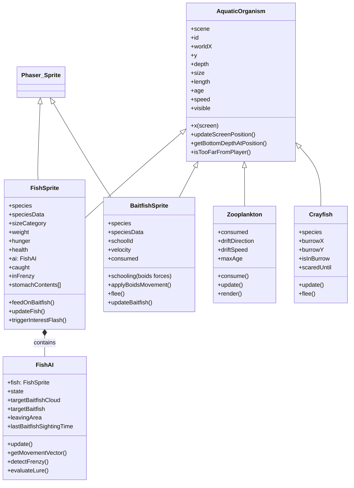
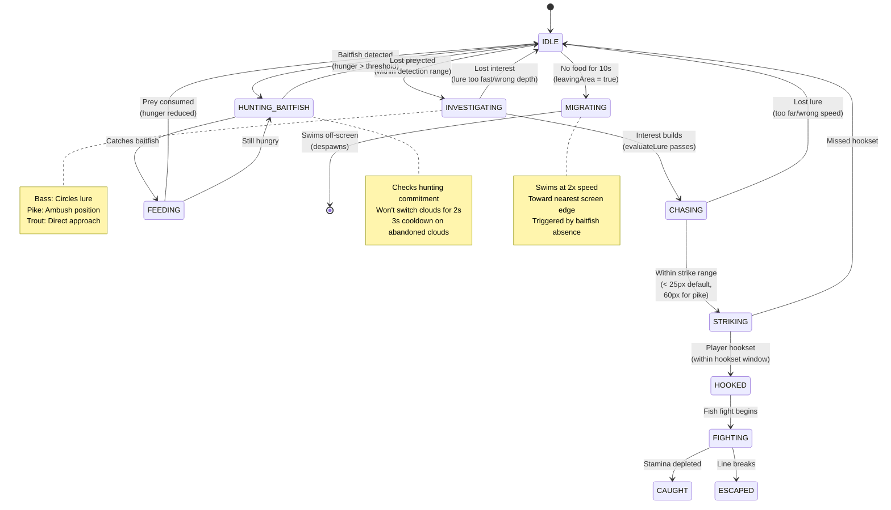
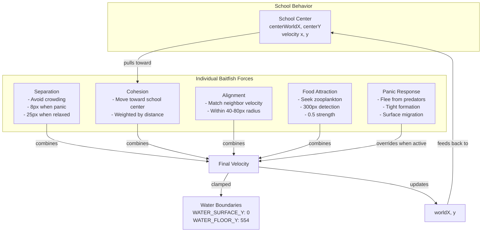
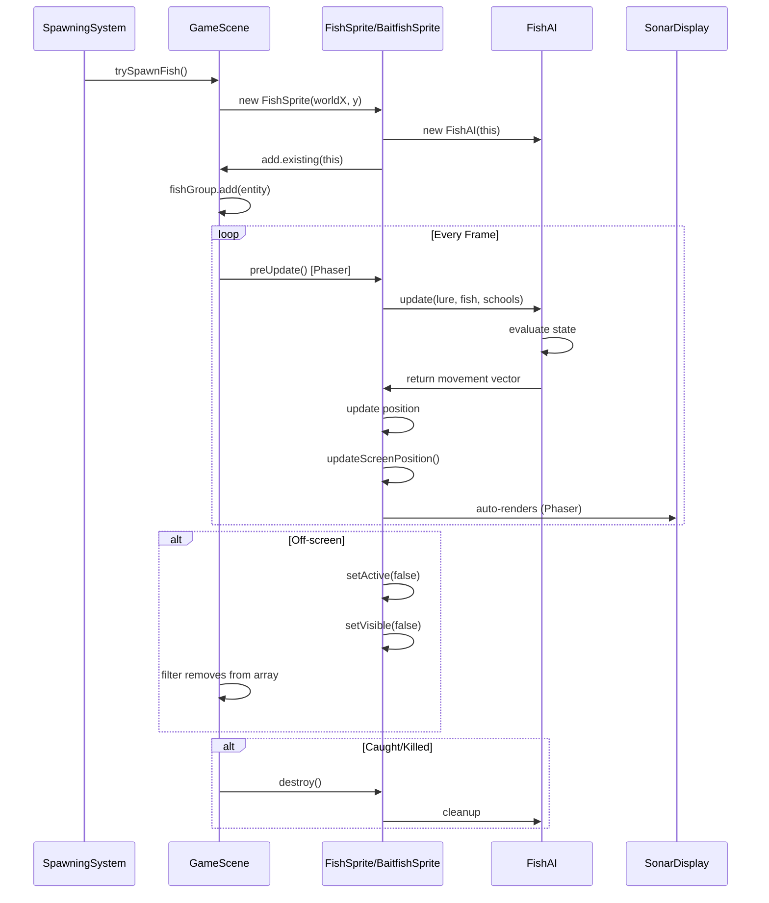

# Wolfpack Fishing Game - Architecture Documentation

## 1. Entity Class Hierarchy



## 2. GameScene Architecture

```mermaid
graph TB
    subgraph GameScene["GameScene (Main Orchestrator)"]
        direction TB

        subgraph Entities["Entity Management"]
            Lure[Lure]
            FishGroup[fishGroup: Phaser.Group<br/>Contains FishSprite]
            Schools[schools: School[]<br/>Contains BaitfishSprite]
            Zoops[zooplankton: Zooplankton[]]
            Crays[crayfish: Crayfish[]]
        end

        subgraph Systems["Game Systems"]
            Spawning[SpawningSystem<br/>- trySpawnFish<br/>- trySpawnSchool<br/>- spawnZooplankton<br/>- spawnCrayfish]
            Input[InputSystem<br/>- handleKeyboardInput<br/>- handleGamepadInput<br/>- processTackleBox]
            Collision[CollisionSystem<br/>- checkLureFishCollisions<br/>- checkPredatorPreyCollisions<br/>- checkCrayfishInteractions]
            Debug[DebugSystem<br/>- renderDebugInfo<br/>- drawVisionCones<br/>- displayEntityCounts]
            Notification[NotificationSystem<br/>- showNotification<br/>- displayCatchPopup]
        end

        subgraph Rendering["Rendering Layers"]
            Sonar[SonarDisplay<br/>depth: 0<br/>background/grid]
            ZoopGraphics[zooplanktonGraphics<br/>depth: 10]
            SchoolFX[schoolEffectsGraphics<br/>depth: 3]
            FishSprites[Fish Sprites<br/>depth: 50]
            Line[FishingLine<br/>depth: 60]
        end

        subgraph Models["Game Models"]
            FightModel[FishFight<br/>- tension<br/>- fishStamina<br/>- lineHealth]
            LineModel[FishingLineModel<br/>- type<br/>- testStrength<br/>- stretch]
            ReelModel[ReelModel<br/>- dragSetting<br/>- retrieveSpeed]
        end
    end

    GameScene -->|updates| Systems
    Systems -->|spawn| Entities
    Systems -->|detect| Collision
    Entities -->|render to| Rendering
    Lure -->|can hook| FishGroup
    FishGroup -->|hunts| Schools
    Schools -->|feed on| Zoops
    FightModel -->|uses| LineModel
    FightModel -->|uses| ReelModel
```

## 3. FishAI State Machine



## 4. Ecosystem Flow (Food Chain)

```mermaid
graph LR
    subgraph Bottom["Lake Bottom (85-100ft)"]
        Zoop[Zooplankton<br/>🦠<br/>- Drift slowly<br/>- 50-100s lifespan<br/>- Spawn 80-120 initial]
    end

    subgraph MidWater["Mid-Water (40-85ft)"]
        Schools[Baitfish Schools<br/>🐟🐟🐟<br/>- Rainbow Smelt<br/>- Alewife<br/>- Use Boids algorithm<br/>- 8-25 per school]
    end

    subgraph Predators["Predators (All Depths)"]
        LakeTrout[Lake Trout<br/>🐟<br/>- Hunt baitfish<br/>- Hunt lure<br/>- Migrate when no food]
        Pike[Northern Pike<br/>🐊<br/>- Ambush predator<br/>- Longer strike range]
        Bass[Smallmouth Bass<br/>🐟<br/>- Circles before strike<br/>- Aggressive]
    end

    subgraph Player["Player"]
        Lure[Lure<br/>🎣<br/>- Controlled by player<br/>- Various weights<br/>- Different speeds]
    end

    Zoop -->|consumed by<br/>5px range| Schools
    Schools -->|hunted by<br/>hunger driven| Predators
    Schools -->|flee from| Predators
    Lure -->|attracts| Predators
    Predators -->|strike| Lure

    Schools -.->|no food| Migration1[Swim to surface<br/>& despawn]
    Predators -.->|no food 10s| Migration2[Swim off-screen<br/>& despawn]

    style Zoop fill:#90EE90
    style Schools fill:#87CEEB
    style LakeTrout fill:#FF6347
    style Pike fill:#FFD700
    style Bass fill:#FFA500
    style Lure fill:#00FFFF
```



## 5. Boids Algorithm (Baitfish Schooling)



## 6. Spawning System Flow

```mermaid
flowchart TD
    Start[GameScene Update Loop]
    Start --> Spawn[SpawningSystem.update]

    Spawn --> CheckFish{Fish count < 5?}
    CheckFish -->|Yes| SpawnFish[trySpawnFish<br/>- Random species<br/>- Random size<br/>- Random depth<br/>- Off-screen spawn]
    CheckFish -->|No| CheckSchools

    SpawnFish --> FishGroup[Add to fishGroup<br/>Phaser.Group]

    CheckSchools{School count < 3?}
    CheckSchools -->|Yes| SpawnSchool[trySpawnSchool<br/>- Random species<br/>- 8-25 fish<br/>- Far off-screen]
    CheckSchools -->|No| CheckZoop

    SpawnSchool --> SchoolArray[Add to schools[]]

    CheckZoop{Zooplankton < 200?}
    CheckZoop -->|Yes| SpawnZoop[spawnZooplankton<br/>- 3-6 at a time<br/>- Near player<br/>- Bottom depth]
    CheckZoop -->|No| CheckCray

    SpawnZoop --> ZoopArray[Add to zooplankton[]]

    CheckCray{Crayfish < 15?}
    CheckCray -->|Yes| SpawnCray[spawnCrayfish<br/>- Bottom only<br/>- Random position]
    CheckCray -->|No| End

    SpawnCray --> CrayArray[Add to crayfish[]]

    FishGroup --> End[Continue Update]
    SchoolArray --> End
    ZoopArray --> End
    CrayArray --> End
```

## 7. Key Coordinate Systems

```mermaid
graph TB
    subgraph WorldCoordinates["World Coordinates"]
        WorldX[worldX<br/>Absolute position in lake<br/>Never changes with camera]
    end

    subgraph ScreenCoordinates["Screen Coordinates"]
        ScreenX[x (screen)<br/>Position on canvas<br/>Relative to player]
        ScreenY[y<br/>Vertical position<br/>0 = surface<br/>554 = floor]
    end

    subgraph Conversion["Coordinate Conversion"]
        Player[Player Position<br/>Always at screen center<br/>canvasWidth / 2]
        Offset[offsetFromPlayer =<br/>worldX - playerWorldX]
        Final[screenX =<br/>canvasWidth/2 + offset]
    end

    WorldX -->|subtract| Player
    Player -->|equals| Offset
    Offset -->|add to center| Final
    Final --> ScreenX

    subgraph DepthSystem["Depth System"]
        YPos[y position<br/>pixel coordinates]
        Scale[depthScale<br/>pixels per foot]
        Depth[depth in feet<br/>y / depthScale]
    end

    YPos -->|divide by| Scale
    Scale --> Depth
```

## Key Design Patterns

### 1. **Entity-Component Pattern**
- `AquaticOrganism` is base class with shared behavior
- `FishSprite` extends with predator-specific logic
- `FishAI` is a component attached to fish (separation of concerns)

### 2. **Systems Architecture**
- GameScene delegates to specialized systems
- Each system handles one responsibility (spawning, input, collision, etc.)
- Systems can be tested independently

### 3. **Object Pooling (Phaser Groups)**
- `fishGroup` uses Phaser's built-in pooling
- Fish sprites are reused, not destroyed/recreated
- Better performance with many entities

### 4. **State Machine (FishAI)**
- Clear state transitions
- Each state has specific behaviors
- Prevents conflicting actions

### 5. **Boids Flocking**
- Emergent behavior from simple rules
- Each baitfish follows local rules
- Realistic schooling behavior emerges

## Important Files Reference

| File | Purpose |
|------|---------|
| `src/scenes/GameScene.js` | Main orchestrator, entity management |
| `src/entities/FishAI.js` | Predator behavior and decision-making |
| `src/models/AquaticOrganism.js` | Base class for all aquatic life |
| `src/models/FishSprite.js` | Predator fish with AI |
| `src/models/BaitfishSprite.js` | Schooling prey fish |
| `src/models/Zooplankton.js` | Bottom food source |
| `src/scenes/systems/SpawningSystem.js` | Entity spawning logic |
| `src/scenes/systems/CollisionSystem.js` | Interaction detection |
| `src/utils/SonarDisplay.js` | Background rendering |

## Rendering Depth Layers (Z-Index)

```
0   - SonarDisplay (background, lake floor, grid)
2   - (unused)
3   - School effects graphics
10  - Zooplankton graphics
50  - Fish sprites (FishSprite, BaitfishSprite)
60  - Fishing line
100 - Depth markers, UI text
2000+ - Tackle box, menus, overlays
```

## Entity Lifecycle



## Migration Behavior (NEW)

Predators now migrate away when no food is available:

1. **Detection**: `FishAI` tracks `lastBaitfishSightingTime`
2. **Timeout**: After 10 seconds with no baitfish, sets `leavingArea = true`
3. **Direction**: Picks nearest screen edge (left or right)
4. **Speed**: Swims at 2x normal speed horizontally
5. **Despawn**: Automatically removed when off-screen

This creates a natural "clearing" of the game area, allowing new spawns.
