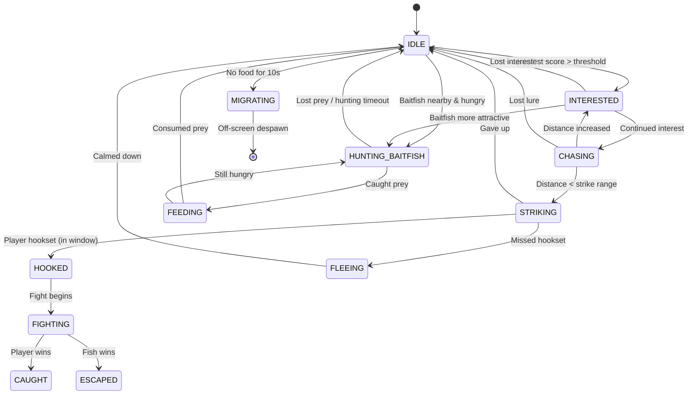
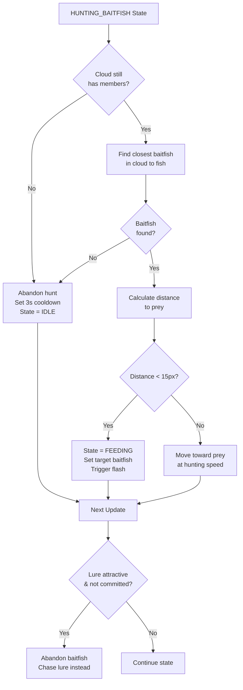

# FishAI Decision-Making Guide

This document explains how the FishAI system works in detail.

## FishAI Overview

The `FishAI` class (`src/entities/FishAI.js`) is the brain of every predator fish. It's a component attached to each `FishSprite` and handles all decision-making.

## Core Properties

```javascript
{
    fish: FishSprite,              // Reference to the fish it controls
    state: FISH_STATE,              // Current behavior state
    alertness: 0.5-1.0,             // How aware the fish is
    baseAggressiveness: 0.5-1.0,    // Personality trait
    speedPreference: 1.5-3.5,       // Preferred lure speed

    // Migration
    lastBaitfishSightingTime: timestamp,
    baitfishTimeout: 10000,         // 10 seconds
    leavingArea: boolean,           // Migration flag

    // Hunting
    targetBaitfishCloud: School,
    targetBaitfish: BaitfishSprite,
    huntingStartTime: timestamp,
    minHuntingCommitment: 2000,     // Must hunt for 2s min

    // Species-specific
    isAmbushPredator: boolean,      // Pike behavior
    circlesBeforeStrike: boolean,   // Bass behavior
}
```

## State Machine



## Decision Flow Diagram

```mermaid
flowchart TD
    Start[AI Update Called]
    Start --> Init{First update?}
    Init -->|Yes| SetTime[lastBaitfishSightingTime = now]
    Init -->|No| CheckMigration

    SetTime --> CheckMigration

    CheckMigration{Any baitfish<br/>schools visible?}
    CheckMigration -->|Yes| ResetTimer[Reset lastBaitfishSightingTime<br/>leavingArea = false]
    CheckMigration -->|No| CheckTimeout

    CheckTimeout{Time since last<br/>baitfish > 10s?}
    CheckTimeout -->|Yes| StartMigration[leavingArea = true<br/>Pick nearest edge<br/>State = IDLE]
    CheckTimeout -->|No| CheckObservation

    ResetTimer --> CheckObservation
    StartMigration --> Return[Return movement vector]

    CheckObservation{Lure in water?}
    CheckObservation -->|No| NatureMode[Nature Mode:<br/>Only hunt baitfish]
    CheckObservation -->|Yes| FishingMode

    NatureMode --> Return

    FishingMode[Normal Fishing Mode]
    FishingMode --> CalcDistance[Calculate distance to lure<br/>depth difference<br/>lure speed]

    CalcDistance --> DetectFrenzy[Check frenzy conditions:<br/>Other fish chasing?<br/>Multiple baitfish feeding?]

    DetectFrenzy --> StateMachine{Current State?}

    StateMachine -->|IDLE| IdleLogic
    StateMachine -->|INTERESTED| InterestedLogic
    StateMachine -->|CHASING| ChasingLogic
    StateMachine -->|STRIKING| StrikingLogic
    StateMachine -->|FLEEING| FleeingLogic
    StateMachine -->|HUNTING| HuntingLogic
    StateMachine -->|FEEDING| FeedingLogic

    IdleLogic --> IdleCheck{Baitfish nearby<br/>& hungry?}
    IdleCheck -->|Yes| StartHunt[Start hunting baitfish]
    IdleCheck -->|No| LureCheck

    LureCheck[Calculate Interest Score]
    LureCheck --> Components[Distance: 30 pts<br/>Speed match: 25 pts<br/>Depth match: 20 pts<br/>Lure action: 15 pts]
    Components --> Modifiers[× aggressiveness<br/>+ frenzy bonus]
    Modifiers --> Threshold{Score > threshold?}

    Threshold -->|Yes| VeryClose{Distance < 40%<br/>detection range?}
    VeryClose -->|Yes| DirectChase[Skip to CHASING]
    VeryClose -->|No| BecomeInterested[State = INTERESTED]
    Threshold -->|No| StayIdle[Stay IDLE]

    InterestedLogic --> IntCheck{Baitfish more<br/>attractive?}
    IntCheck -->|Yes| StartHunt
    IntCheck -->|No| EvalLure[evaluateLure]

    ChasingLogic --> ChaseCheck{Within strike<br/>distance?}
    ChaseCheck -->|Yes| Strike[State = STRIKING<br/>Trigger hookset window]
    ChaseCheck -->|No| ValidateChase{Still interested?}
    ValidateChase -->|Yes| ContinueChase[Keep chasing]
    ValidateChase -->|No| LoseInterest[Back to INTERESTED/IDLE]

    StrikingLogic --> HooksetCheck{Player hookset<br/>in window?}
    HooksetCheck -->|Yes| Hooked[State = HOOKED]
    HooksetCheck -->|No| Missed[State = FLEEING]

    HuntingLogic --> CloudCheck{Cloud still<br/>valid?}
    CloudCheck -->|Yes| FindPrey[Find closest baitfish<br/>in cloud]
    CloudCheck -->|No| AbandonHunt[Abandon cloud<br/>3s cooldown]

    FindPrey --> PreyCheck{Found prey?}
    PreyCheck -->|Yes| CloseEnough{Within<br/>catch range?}
    CloseEnough -->|Yes| CatchPrey[State = FEEDING<br/>Prey consumed]
    CloseEnough -->|No| ChasePrey[Chase prey]
    PreyCheck -->|No| AbandonHunt

    FeedingLogic --> Consume[Reduce hunger<br/>Add to stomach]
    Consume --> HealthCheck{Hunger = 0?}
    HealthCheck -->|Yes| RestoreHealth[Excess nutrition<br/>restores health]
    HealthCheck -->|No| DoneFeeding
    RestoreHealth --> DoneFeeding[State = IDLE or<br/>continue hunting]

    StartHunt --> Return
    DirectChase --> Return
    BecomeInterested --> Return
    StayIdle --> Return
    Strike --> Return
    ContinueChase --> Return
    Hooked --> Return
    Missed --> Return
    ChasePrey --> Return
    DoneFeeding --> Return
```



## Interest Score Calculation (IDLE State)

When a fish is IDLE, it evaluates whether to become interested in the lure:

### Base Factors

```javascript
let interestScore = 0;

// 1. Distance (30 points max)
// Closer = more interesting
interestScore += (1 - verticalDistance / VERTICAL_DETECTION_RANGE) * 30;

// 2. Speed Match (25 points if matched, negative if wrong)
const speedDiff = Math.abs(lureSpeed - fish.speedPreference);
if (speedDiff < SPEED_TOLERANCE) {
    interestScore += 25;
} else {
    interestScore -= speedDiff * 5; // Penalty for wrong speed
}

// 3. Depth Preference (20 points if close to preferred depth)
if (depthDifference < 20) {
    interestScore += 20;
}

// 4. Lure Action (15 points for active movement)
if (lure.state === RETRIEVING || lure.state === DROPPING) {
    interestScore += 15;
}
```

### Multipliers

```javascript
// Personality modifier
interestScore *= fish.aggressiveness; // 0.5 to 1.0 + depth bonus

// Frenzy bonus (massive boost)
if (fish.inFrenzy) {
    interestScore += 30 * fish.frenzyIntensity; // 0-30 extra points
}
```

### Decision Threshold

```javascript
const threshold = fish.depthZone.interestThreshold;

if (interestScore > threshold) {
    if (distance < DETECTION_RANGE * 0.4) {
        state = CHASING; // Skip INTERESTED if very close
    } else {
        state = INTERESTED;
    }
}
```

### Auto-Engage Shortcut

```javascript
// If lure speed EXACTLY matches fish preference, skip calculation!
const speedDiff = Math.abs(lureSpeed - fish.speedPreference);
if (speedDiff < 0.5 && distance < DETECTION_RANGE * 0.8) {
    engageFish(); // Instant engagement
}
```

## Species-Specific Behaviors

### Northern Pike (Ambush Predator)

```javascript
if (species === 'northern_pike') {
    isAmbushPredator = true;
    strikeRange = 60;        // Longer than default (25)
    burstSpeed = 2.5;        // Explosive strikes

    // Behavior:
    // - Holds position near ambush point
    // - Patrols within 50px radius
    // - Explosive burst when prey enters range
    // - Won't chase far from ambush spot
}
```

### Smallmouth Bass (Circling)

```javascript
if (species === 'smallmouth_bass') {
    circlesBeforeStrike = true;
    circleRadius = 35;
    circleSpeed = 0.08;      // radians per frame
    maxCircleTime = 120;     // 2 seconds

    // Behavior:
    // - Circles around lure
    // - Evaluates while circling
    // - Strikes after circling period
    // - Or loses interest if not convinced
}
```

### Lake Trout (Default)

```javascript
// Direct pursuit behavior
// - Straightforward chase
// - Evaluates continuously
// - Speed-matching critical
// - Depth-sensitive
```

## Baitfish Hunting Logic

### Should Hunt Baitfish?

```javascript
shouldHuntBaitfish(cloud) {
    if (!cloud || !cloud.members || cloud.members.length === 0) {
        return false;
    }

    // 1. Hunger check
    if (fish.hunger < 60) { // Not hungry enough
        return false;
    }

    // 2. Cloud recently abandoned?
    if (cloud === lastAbandonedCloud) {
        if (now - abandonTime < 3000) { // 3s cooldown
            return false;
        }
    }

    // 3. Currently committed to different cloud?
    if (state === HUNTING_BAITFISH && targetCloud !== cloud) {
        if (now - huntingStartTime < minHuntingCommitment) { // 2s
            return false; // Must finish current hunt
        }
    }

    // 4. Diet preference
    const preference = calculateDietPreference(fish.species, cloud.species);
    return Math.random() < preference; // 0.3-1.0 chance based on preference
}
```

### Hunting Behavior



### Feeding Behavior

```javascript
feedingBehavior(baitfishClouds, lure) {
    if (!targetBaitfish || !targetBaitfish.visible) {
        state = IDLE; // Lost prey
        return;
    }

    const distance = calculateDistance(fish, targetBaitfish);

    if (distance < 10) { // Very close
        // CONSUME THE PREY
        targetBaitfish.consume(); // Mark as consumed
        targetBaitfish.visible = false;

        fish.feedOnBaitfish(targetBaitfish.species);
        // ^ This reduces hunger, adds to stomach, potentially restores health

        // Done feeding this one
        targetBaitfish = null;
        state = IDLE;

        // If still hungry, might hunt again immediately
    } else {
        // Move toward prey to finish feeding
        moveToward(targetBaitfish);
    }
}
```

## Migration Behavior (NEW)

### When Fish Leave

```javascript
update(lure, currentTime, allFish, baitfishClouds, crayfish) {
    // 1. Initialize timer on first update
    if (lastBaitfishSightingTime === null) {
        lastBaitfishSightingTime = currentTime;
    }

    // 2. Count valid baitfish schools
    const validClouds = baitfishClouds.filter(cloud => {
        return cloud.visible && cloud.members.length > 0;
    });

    // 3. Update timer based on food availability
    if (validClouds.length > 0) {
        // Food available! Reset timer
        lastBaitfishSightingTime = currentTime;
        leavingArea = false;
    } else if (!leavingArea &&
               currentTime - lastBaitfishSightingTime > 10000) {
        // No food for 10+ seconds - MIGRATE!
        console.log(`${fish.name} sees no food, migrating away...`);
        leavingArea = true;
        state = IDLE;

        // Pick direction (toward nearest screen edge)
        const canvasWidth = scene.scale.width;
        const screenCenter = canvasWidth / 2;
        idleDirection = fish.worldX > screenCenter ? 1 : -1;
    }
}
```

### Migration Movement

```javascript
getMovementVector() {
    // Migration overrides all other behavior
    if (leavingArea) {
        return {
            x: fish.speed * 2 * idleDirection, // 2x speed!
            y: 0  // Straight horizontal
        };
    }

    // ... normal movement logic for other states
}
```

### Despawn

Migration doesn't directly despawn fish - they swim off-screen naturally:

```javascript
// In FishSprite.updateFish()
const canvasWidth = scene.scale.width;
const margin = 200;
const isOffScreen = x < -margin || x > canvasWidth + margin;

if (isOffScreen) {
    setActive(false);
    setVisible(false);
    // GameScene filter will remove from array
}
```

## Movement Calculation

Each state returns a different movement vector:

```javascript
getMovementVector() {
    // 1. MIGRATION (highest priority)
    if (leavingArea) {
        return { x: speed * 2 * idleDirection, y: 0 };
    }

    // 2. IDLE - Random swimming
    if (state === IDLE) {
        return {
            x: baseSpeed * idleDirection,
            y: driftTowardPreferredDepth()
        };
    }

    // 3. INTERESTED - Approach lure cautiously
    if (state === INTERESTED) {
        const angle = angleToTarget(lure);
        return {
            x: Math.cos(angle) * speed * 0.5, // Slow approach
            y: Math.sin(angle) * speed * 0.5
        };
    }

    // 4. CHASING - Direct pursuit
    if (state === CHASING) {
        if (circlesBeforeStrike && !isCircling) {
            // Bass: Circle first
            return calculateCircleMovement();
        }

        if (isAmbushPredator) {
            // Pike: Explosive burst
            const angle = angleToTarget(lure);
            return {
                x: Math.cos(angle) * speed * burstSpeed,
                y: Math.sin(angle) * speed * burstSpeed
            };
        }

        // Normal: Direct chase
        const angle = angleToTarget(lure);
        return {
            x: Math.cos(angle) * speed,
            y: Math.sin(angle) * speed
        };
    }

    // 5. STRIKING - Final lunge
    if (state === STRIKING) {
        const angle = angleToTarget(lure);
        return {
            x: Math.cos(angle) * speed * 1.5,
            y: Math.sin(angle) * speed * 1.5
        };
    }

    // 6. FLEEING - Run away
    if (state === FLEEING) {
        const angle = angleToTarget(lure) + Math.PI; // Opposite direction
        return {
            x: Math.cos(angle) * speed * 2,
            y: Math.sin(angle) * speed * 2
        };
    }

    // 7. HUNTING_BAITFISH - Chase prey
    if (state === HUNTING_BAITFISH && targetBaitfish) {
        const angle = angleToTarget(targetBaitfish);
        return {
            x: Math.cos(angle) * speed * 0.8,
            y: Math.sin(angle) * speed * 0.8
        };
    }

    // 8. FEEDING - Final approach to prey
    if (state === FEEDING && targetBaitfish) {
        const angle = angleToTarget(targetBaitfish);
        return {
            x: Math.cos(angle) * speed * 0.3, // Very slow final approach
            y: Math.sin(angle) * speed * 0.3
        };
    }

    return { x: 0, y: 0 };
}
```

## Frenzy Detection

Fish can enter a feeding frenzy when they see other fish actively feeding:

```javascript
detectFrenzy(lure, allFish, baitfishClouds) {
    // Count fish chasing lure
    const chasingFish = allFish.filter(f =>
        f !== fish &&
        (f.ai.state === CHASING || f.ai.state === STRIKING)
    );

    // Count fish feeding on baitfish
    const feedingFish = allFish.filter(f =>
        f !== fish &&
        f.ai.state === FEEDING
    );

    const excitedCount = chasingFish.length + feedingFish.length;

    if (excitedCount >= 2) {
        // Multiple fish active - FRENZY!
        fish.inFrenzy = true;
        fish.frenzyIntensity = Math.min(1.0, excitedCount * 0.3);
        fish.frenzyTimer = 300; // 5 seconds
    } else if (fish.frenzyTimer > 0) {
        // Decay frenzy
        fish.frenzyTimer--;
        if (fish.frenzyTimer === 0) {
            fish.inFrenzy = false;
            fish.frenzyIntensity = 0;
        }
    }
}
```

## Tuning Parameters

Key values you can adjust:

| Parameter | Default | Effect |
|-----------|---------|--------|
| `DETECTION_RANGE` | 150 | How far fish can see lure horizontally |
| `VERTICAL_DETECTION_RANGE` | 200 | How far fish can see lure vertically |
| `STRIKE_DISTANCE` | 25 | How close before strike (60 for pike) |
| `SPEED_TOLERANCE` | 0.8 | How much speed can vary from preference |
| `minHuntingCommitment` | 2000ms | Min time hunting baitfish before switching |
| `abandonCooldown` | 3000ms | Time before rehunting abandoned cloud |
| `baitfishTimeout` | 10000ms | Time before migration (no food) |
| `aggressiveness` | 0.5-1.0 | Base personality + depth bonus |
| `speedPreference` | 1.5-3.5 | Individual fish speed preference |

## Tips for Players

Based on the AI:

1. **Match Speed Preferences**: Fish have individual speed preferences (1.5-3.5). Try different retrieval speeds!

2. **Depth Matters**: Fish are more interested in lures near their preferred depth

3. **Trigger Frenzy**: If you get 2+ fish chasing, others will join in

4. **Pike Strategy**: Pike won't chase far - bring lure near their ambush position

5. **Bass Strategy**: Bass will circle - maintain steady speed while they evaluate

6. **Migration**: If fish leave after 10s, it means they're hungry but no baitfish around. New fish will spawn.

7. **Baitfish Competition**: Fish may ignore your lure if hunting real prey. Wait for them to finish feeding or use a lure that triggers frenzy.
